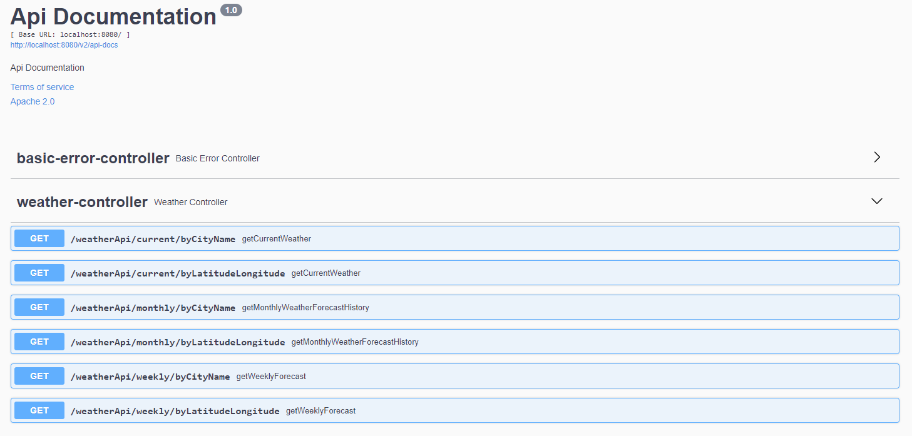

# Definex Java Spring Practicum Third Homework - Weather Api

### Requirements

- Create an accurate API structure.
- Make a verification for parameters.
- Handle exceptions.

### Endpoints



### Api Responses

<details>
  <summary>Current Weather By City Name</summary>

- Request URL: http://localhost:8080/weatherApi/current/byCityName?cityName=istanbul

### Response JSON

  ```json
{
  "httpStatus": 200,
  "message": "Current weather forecast.",
  "data": {
    "location": {
      "name": "Istanbul",
      "country": "Turkey",
      "lat": 41.02,
      "lon": 28.96,
      "localtime": "2023-02-08 17:54"
    },
    "current": {
      "last_updated": "2023-02-08 17:45",
      "temp_c": 1,
      "temp_f": 33.8,
      "feelslike_c": -4.8,
      "feelslike_f": 23.4,
      "condition": {
        "text": "Light snow",
        "code": 1213
      }
    },
    "forecast": {
      "forecastday": [
        {
          "date": "2023-02-08",
          "day": {
            "maxtemp_c": 4.3,
            "maxtemp_f": 39.7,
            "avgtemp_c": 2.4,
            "avgtemp_f": 36.4,
            "mintemp_c": 1.1,
            "mintemp_f": 34,
            "condition": {
              "text": "Moderate rain",
              "code": 1189
            }
          }
        }
      ]
    }
  }
}
```
</details>
<!-- -->
<details>
  <summary>Current Weather By Latitude And Longitude</summary>

- Request URL: http://localhost:8080/weatherApi/current/byLatitudeLongitude?lat=52.520008&lon=13.404954

### Response JSON

  ```json
{
  "httpStatus": 200,
  "message": "Current weather forecast.",
  "data": {
    "location": {
      "name": "Berlin",
      "country": "Germany",
      "lat": 52.52,
      "lon": 13.4,
      "localtime": "2023-02-08 16:51"
    },
    "current": {
      "last_updated": "2023-02-08 16:45",
      "temp_c": 1,
      "temp_f": 33.8,
      "feelslike_c": -1.8,
      "feelslike_f": 28.9,
      "condition": {
        "text": "Sunny",
        "code": 1000
      }
    },
    "forecast": {
      "forecastday": [
        {
          "date": "2023-02-08",
          "day": {
            "maxtemp_c": 4.3,
            "maxtemp_f": 39.7,
            "avgtemp_c": 0.1,
            "avgtemp_f": 32.1,
            "mintemp_c": -2.3,
            "mintemp_f": 27.9,
            "condition": {
              "text": "Sunny",
              "code": 1000
            }
          }
        }
      ]
    }
  }
}
```
</details>
<!-- -->
<details>
  <summary>Monthly Weather By City Name</summary>

- Request URL: http://localhost:8080/weatherApi/monthly/byCityName?cityName=Sirnak


### Response JSON

  ```json
{
  "httpStatus": 200,
  "message": "Monthly weather forecast.",
  "data": {
    "location": {
      "name": "Sirnak",
      "country": "Turkey",
      "lat": 37.52,
      "lon": 42.46,
      "localtime": "2023-02-08 19:00"
    },
    "current": {
      "last_updated": "2023-02-08 19:00",
      "temp_c": -3.1,
      "temp_f": 26.4,
      "feelslike_c": -3.1,
      "feelslike_f": 26.4,
      "condition": {
        "text": "Moderate or heavy snow showers",
        "code": 1258
      }
    },
    "forecast": {
      "forecastday": [
        {
          "date": "2023-02-08",
          "day": {
            "maxtemp_c": -0.2,
            "maxtemp_f": 31.6,
            "avgtemp_c": -2.1,
            "avgtemp_f": 28.2,
            "mintemp_c": -4.1,
            "mintemp_f": 24.6,
            "condition": {
              "text": "Moderate or heavy snow showers",
              "code": 1258
            }
          }
        },
        {
          "date": "2023-02-09",
          "day": {
            "maxtemp_c": -0.6,
            "maxtemp_f": 30.9,
            "avgtemp_c": -4.5,
            "avgtemp_f": 23.8,
            "mintemp_c": -8.4,
            "mintemp_f": 16.9,
            "condition": {
              "text": "Patchy moderate snow",
              "code": 1216
            }
          }
        },
        {
          "date": "2023-02-10",
          "day": {
            "maxtemp_c": 0.8,
            "maxtemp_f": 33.4,
            "avgtemp_c": -4.7,
            "avgtemp_f": 23.6,
            "mintemp_c": -8.2,
            "mintemp_f": 17.2,
            "condition": {
              "text": "Sunny",
              "code": 1000
            }
          }
        },
        {
          "date": "2023-02-11",
          "day": {
            "maxtemp_c": 1,
            "maxtemp_f": 33.8,
            "avgtemp_c": -4.3,
            "avgtemp_f": 24.2,
            "mintemp_c": -7.8,
            "mintemp_f": 18,
            "condition": {
              "text": "Sunny",
              "code": 1000
            }
          }
        },
        {
          "date": "2023-02-12",
          "day": {
            "maxtemp_c": 0.6,
            "maxtemp_f": 33.1,
            "avgtemp_c": -3.1,
            "avgtemp_f": 26.4,
            "mintemp_c": -7,
            "mintemp_f": 19.4,
            "condition": {
              "text": "Partly cloudy",
              "code": 1003
            }
          }
        },
        {
          "date": "2023-02-13",
          "day": {
            "maxtemp_c": 1.2,
            "maxtemp_f": 34.2,
            "avgtemp_c": -3.5,
            "avgtemp_f": 25.8,
            "mintemp_c": -6,
            "mintemp_f": 21.2,
            "condition": {
              "text": "Sunny",
              "code": 1000
            }
          }
        },
        {
          "date": "2023-02-14",
          "day": {
            "maxtemp_c": 1.4,
            "maxtemp_f": 34.5,
            "avgtemp_c": -2.9,
            "avgtemp_f": 26.8,
            "mintemp_c": -5.9,
            "mintemp_f": 21.4,
            "condition": {
              "text": "Sunny",
              "code": 1000
            }
          }
        },
        {
          "date": "2023-02-15",
          "day": {
            "maxtemp_c": 0.2,
            "maxtemp_f": 32.4,
            "avgtemp_c": -3.2,
            "avgtemp_f": 26.2,
            "mintemp_c": -5.4,
            "mintemp_f": 22.3,
            "condition": {
              "text": "Light freezing rain",
              "code": 1198
            }
          }
        },
        {
          "date": "2023-02-16",
          "day": {
            "maxtemp_c": 1.2,
            "maxtemp_f": 34.2,
            "avgtemp_c": -3.4,
            "avgtemp_f": 25.8,
            "mintemp_c": -6.7,
            "mintemp_f": 19.9,
            "condition": {
              "text": "Sunny",
              "code": 1000
            }
          }
        },
        {
          "date": "2023-02-17",
          "day": {
            "maxtemp_c": 2,
            "maxtemp_f": 35.6,
            "avgtemp_c": -2.7,
            "avgtemp_f": 27.2,
            "mintemp_c": -5.7,
            "mintemp_f": 21.7,
            "condition": {
              "text": "Sunny",
              "code": 1000
            }
          }
        },
        {
          "date": "2023-02-18",
          "day": {
            "maxtemp_c": 3.2,
            "maxtemp_f": 37.8,
            "avgtemp_c": -1,
            "avgtemp_f": 30.3,
            "mintemp_c": -4.2,
            "mintemp_f": 24.4,
            "condition": {
              "text": "Partly cloudy",
              "code": 1003
            }
          }
        },
        {
          "date": "2023-02-19",
          "day": {
            "maxtemp_c": 4.6,
            "maxtemp_f": 40.3,
            "avgtemp_c": 1.2,
            "avgtemp_f": 34.1,
            "mintemp_c": -2.3,
            "mintemp_f": 27.9,
            "condition": {
              "text": "Partly cloudy",
              "code": 1003
            }
          }
        },
        {
          "date": "2023-02-20",
          "day": {
            "maxtemp_c": 7.3,
            "maxtemp_f": 45.1,
            "avgtemp_c": 3.2,
            "avgtemp_f": 37.7,
            "mintemp_c": 0.3,
            "mintemp_f": 32.5,
            "condition": {
              "text": "Sunny",
              "code": 1000
            }
          }
        },
        {
          "date": "2023-02-21",
          "day": {
            "maxtemp_c": 5.8,
            "maxtemp_f": 42.4,
            "avgtemp_c": 2.8,
            "avgtemp_f": 37.1,
            "mintemp_c": 0.3,
            "mintemp_f": 32.5,
            "condition": {
              "text": "Patchy rain possible",
              "code": 1063
            }
          }
        },
        {
          "date": "2023-02-22",
          "day": {
            "maxtemp_c": 11.2,
            "maxtemp_f": 52.2,
            "avgtemp_c": 7.9,
            "avgtemp_f": 46.3,
            "mintemp_c": 2.4,
            "mintemp_f": 36.3,
            "condition": {
              "text": "Moderate or heavy rain shower",
              "code": 1243
            }
          }
        },
        {
          "date": "2023-02-23",
          "day": {
            "maxtemp_c": 12.1,
            "maxtemp_f": 53.8,
            "avgtemp_c": 8.8,
            "avgtemp_f": 47.9,
            "mintemp_c": 3,
            "mintemp_f": 37.4,
            "condition": {
              "text": "Moderate or heavy rain shower",
              "code": 1243
            }
          }
        },
        {
          "date": "2023-02-24",
          "day": {
            "maxtemp_c": 13.1,
            "maxtemp_f": 55.6,
            "avgtemp_c": 9.7,
            "avgtemp_f": 49.5,
            "mintemp_c": 3.6,
            "mintemp_f": 38.6,
            "condition": {
              "text": "Heavy rain at times",
              "code": 1192
            }
          }
        },
        {
          "date": "2023-02-25",
          "day": {
            "maxtemp_c": 13,
            "maxtemp_f": 55.3,
            "avgtemp_c": 9.8,
            "avgtemp_f": 49.7,
            "mintemp_c": 4.5,
            "mintemp_f": 40,
            "condition": {
              "text": "Moderate or heavy rain shower",
              "code": 1243
            }
          }
        },
        {
          "date": "2023-02-26",
          "day": {
            "maxtemp_c": 12.8,
            "maxtemp_f": 55,
            "avgtemp_c": 9.6,
            "avgtemp_f": 49.3,
            "mintemp_c": 4.3,
            "mintemp_f": 39.8,
            "condition": {
              "text": "Moderate or heavy rain shower",
              "code": 1243
            }
          }
        },
        {
          "date": "2023-02-27",
          "day": {
            "maxtemp_c": 13.2,
            "maxtemp_f": 55.7,
            "avgtemp_c": 10,
            "avgtemp_f": 49.9,
            "mintemp_c": 4.6,
            "mintemp_f": 40.3,
            "condition": {
              "text": "Moderate or heavy rain shower",
              "code": 1243
            }
          }
        },
        {
          "date": "2023-02-28",
          "day": {
            "maxtemp_c": 13,
            "maxtemp_f": 55.4,
            "avgtemp_c": 10.3,
            "avgtemp_f": 50.5,
            "mintemp_c": 5.7,
            "mintemp_f": 42.2,
            "condition": {
              "text": "Moderate or heavy rain shower",
              "code": 1243
            }
          }
        },
        {
          "date": "2023-03-01",
          "day": {
            "maxtemp_c": 12.3,
            "maxtemp_f": 54.2,
            "avgtemp_c": 9.2,
            "avgtemp_f": 48.5,
            "mintemp_c": 3.8,
            "mintemp_f": 38.8,
            "condition": {
              "text": "Moderate or heavy rain shower",
              "code": 1243
            }
          }
        },
        {
          "date": "2023-03-02",
          "day": {
            "maxtemp_c": 12,
            "maxtemp_f": 53.5,
            "avgtemp_c": 9.1,
            "avgtemp_f": 48.4,
            "mintemp_c": 3.6,
            "mintemp_f": 38.4,
            "condition": {
              "text": "Moderate or heavy rain shower",
              "code": 1243
            }
          }
        },
        {
          "date": "2023-03-03",
          "day": {
            "maxtemp_c": 12.2,
            "maxtemp_f": 54,
            "avgtemp_c": 9.7,
            "avgtemp_f": 49.4,
            "mintemp_c": 5.1,
            "mintemp_f": 41.2,
            "condition": {
              "text": "Moderate or heavy rain shower",
              "code": 1243
            }
          }
        },
        {
          "date": "2023-03-04",
          "day": {
            "maxtemp_c": 11.4,
            "maxtemp_f": 52.5,
            "avgtemp_c": 9.1,
            "avgtemp_f": 48.3,
            "mintemp_c": 5.3,
            "mintemp_f": 41.5,
            "condition": {
              "text": "Moderate or heavy rain shower",
              "code": 1243
            }
          }
        },
        {
          "date": "2023-03-05",
          "day": {
            "maxtemp_c": 12.5,
            "maxtemp_f": 54.6,
            "avgtemp_c": 9.4,
            "avgtemp_f": 48.8,
            "mintemp_c": 3.6,
            "mintemp_f": 38.4,
            "condition": {
              "text": "Moderate or heavy rain shower",
              "code": 1243
            }
          }
        },
        {
          "date": "2023-03-06",
          "day": {
            "maxtemp_c": 13.6,
            "maxtemp_f": 56.5,
            "avgtemp_c": 10.3,
            "avgtemp_f": 50.6,
            "mintemp_c": 4.4,
            "mintemp_f": 39.8,
            "condition": {
              "text": "Heavy rain at times",
              "code": 1192
            }
          }
        },
        {
          "date": "2023-03-07",
          "day": {
            "maxtemp_c": 14.5,
            "maxtemp_f": 58.1,
            "avgtemp_c": 10.8,
            "avgtemp_f": 51.5,
            "mintemp_c": 4.4,
            "mintemp_f": 39.9,
            "condition": {
              "text": "Moderate or heavy rain shower",
              "code": 1243
            }
          }
        },
        {
          "date": "2023-03-08",
          "day": {
            "maxtemp_c": 15.9,
            "maxtemp_f": 60.6,
            "avgtemp_c": 12.1,
            "avgtemp_f": 53.8,
            "mintemp_c": 5.5,
            "mintemp_f": 41.9,
            "condition": {
              "text": "Moderate or heavy rain shower",
              "code": 1243
            }
          }
        },
        {
          "date": "2023-03-09",
          "day": {
            "maxtemp_c": 15.9,
            "maxtemp_f": 60.7,
            "avgtemp_c": 12.4,
            "avgtemp_f": 54.3,
            "mintemp_c": 6.2,
            "mintemp_f": 43.1,
            "condition": {
              "text": "Moderate or heavy rain shower",
              "code": 1243
            }
          }
        }
      ]
    }
  }
}
```
</details>
<!-- -->
<details>
  <summary>Monthly Weather By Latitude And Longitude</summary>

- Request URL: http://localhost:8080/weatherApi/monthly/byLatitudeLongitude?lat=44.439663&lon=26.096306


### Response JSON

  ```json
{
  "httpStatus": 200,
  "message": "Monthly weather forecast.",
  "data": {
    "location": {
      "name": "Bucharest",
      "country": "Romania",
      "lat": 44.44,
      "lon": 26.1,
      "localtime": "2023-02-08 18:05"
    },
    "current": {
      "last_updated": "2023-02-08 18:00",
      "temp_c": -2,
      "temp_f": 28.4,
      "feelslike_c": -7.6,
      "feelslike_f": 18.3,
      "condition": {
        "text": "Clear",
        "code": 1000
      }
    },
    "forecast": {
      "forecastday": [
        {
          "date": "2023-02-08",
          "day": {
            "maxtemp_c": 0,
            "maxtemp_f": 32,
            "avgtemp_c": -2.1,
            "avgtemp_f": 28.2,
            "mintemp_c": -3.8,
            "mintemp_f": 25.2,
            "condition": {
              "text": "Moderate snow",
              "code": 1219
            }
          }
        },
        {
          "date": "2023-02-09",
          "day": {
            "maxtemp_c": 2.2,
            "maxtemp_f": 36,
            "avgtemp_c": -1.7,
            "avgtemp_f": 28.9,
            "mintemp_c": -4.1,
            "mintemp_f": 24.6,
            "condition": {
              "text": "Sunny",
              "code": 1000
            }
          }
        },
        {
          "date": "2023-02-10",
          "day": {
            "maxtemp_c": 3.4,
            "maxtemp_f": 38.1,
            "avgtemp_c": -1,
            "avgtemp_f": 30.2,
            "mintemp_c": -3.8,
            "mintemp_f": 25.2,
            "condition": {
              "text": "Sunny",
              "code": 1000
            }
          }
        },
        {
          "date": "2023-02-11",
          "day": {
            "maxtemp_c": 6.3,
            "maxtemp_f": 43.3,
            "avgtemp_c": 1,
            "avgtemp_f": 33.8,
            "mintemp_c": -2,
            "mintemp_f": 28.4,
            "condition": {
              "text": "Partly cloudy",
              "code": 1003
            }
          }
        },
        {
          "date": "2023-02-12",
          "day": {
            "maxtemp_c": 5.7,
            "maxtemp_f": 42.3,
            "avgtemp_c": 1.6,
            "avgtemp_f": 34.9,
            "mintemp_c": -1.2,
            "mintemp_f": 29.8,
            "condition": {
              "text": "Partly cloudy",
              "code": 1003
            }
          }
        },
        {
          "date": "2023-02-13",
          "day": {
            "maxtemp_c": 9.3,
            "maxtemp_f": 48.7,
            "avgtemp_c": 3.4,
            "avgtemp_f": 38.1,
            "mintemp_c": 0.1,
            "mintemp_f": 32.2,
            "condition": {
              "text": "Sunny",
              "code": 1000
            }
          }
        },
        {
          "date": "2023-02-14",
          "day": {
            "maxtemp_c": 10,
            "maxtemp_f": 50,
            "avgtemp_c": 4.3,
            "avgtemp_f": 39.8,
            "mintemp_c": 0.4,
            "mintemp_f": 32.7,
            "condition": {
              "text": "Sunny",
              "code": 1000
            }
          }
        },
        {
          "date": "2023-02-15",
          "day": {
            "maxtemp_c": 8.5,
            "maxtemp_f": 47.3,
            "avgtemp_c": 4.7,
            "avgtemp_f": 40.5,
            "mintemp_c": 1,
            "mintemp_f": 33.8,
            "condition": {
              "text": "Partly cloudy",
              "code": 1003
            }
          }
        },
        {
          "date": "2023-02-16",
          "day": {
            "maxtemp_c": 7.8,
            "maxtemp_f": 46,
            "avgtemp_c": 4.8,
            "avgtemp_f": 40.6,
            "mintemp_c": 1.7,
            "mintemp_f": 35.1,
            "condition": {
              "text": "Partly cloudy",
              "code": 1003
            }
          }
        },
        {
          "date": "2023-02-17",
          "day": {
            "maxtemp_c": 4.5,
            "maxtemp_f": 40.1,
            "avgtemp_c": 3.4,
            "avgtemp_f": 38.2,
            "mintemp_c": 2.5,
            "mintemp_f": 36.5,
            "condition": {
              "text": "Overcast",
              "code": 1009
            }
          }
        },
        {
          "date": "2023-02-18",
          "day": {
            "maxtemp_c": 4.7,
            "maxtemp_f": 40.5,
            "avgtemp_c": 1.8,
            "avgtemp_f": 35.3,
            "mintemp_c": -0.3,
            "mintemp_f": 31.5,
            "condition": {
              "text": "Overcast",
              "code": 1009
            }
          }
        },
        {
          "date": "2023-02-19",
          "day": {
            "maxtemp_c": 4,
            "maxtemp_f": 39.2,
            "avgtemp_c": -0.4,
            "avgtemp_f": 31.3,
            "mintemp_c": -2.9,
            "mintemp_f": 26.8,
            "condition": {
              "text": "Sunny",
              "code": 1000
            }
          }
        },
        {
          "date": "2023-02-20",
          "day": {
            "maxtemp_c": 4.1,
            "maxtemp_f": 39.4,
            "avgtemp_c": -0.7,
            "avgtemp_f": 30.7,
            "mintemp_c": -3.3,
            "mintemp_f": 26.1,
            "condition": {
              "text": "Sunny",
              "code": 1000
            }
          }
        },
        {
          "date": "2023-02-21",
          "day": {
            "maxtemp_c": 5.2,
            "maxtemp_f": 41.4,
            "avgtemp_c": 0.2,
            "avgtemp_f": 32.4,
            "mintemp_c": -3.1,
            "mintemp_f": 26.4,
            "condition": {
              "text": "Sunny",
              "code": 1000
            }
          }
        },
        {
          "date": "2023-02-22",
          "day": {
            "maxtemp_c": 7.3,
            "maxtemp_f": 45.1,
            "avgtemp_c": 5.1,
            "avgtemp_f": 41.1,
            "mintemp_c": 1.5,
            "mintemp_f": 34.7,
            "condition": {
              "text": "Moderate or heavy rain shower",
              "code": 1243
            }
          }
        },
        {
          "date": "2023-02-23",
          "day": {
            "maxtemp_c": 8,
            "maxtemp_f": 46.4,
            "avgtemp_c": 5.5,
            "avgtemp_f": 41.9,
            "mintemp_c": 2.1,
            "mintemp_f": 35.7,
            "condition": {
              "text": "Moderate rain at times",
              "code": 1186
            }
          }
        },
        {
          "date": "2023-02-24",
          "day": {
            "maxtemp_c": 7.2,
            "maxtemp_f": 44.9,
            "avgtemp_c": 5,
            "avgtemp_f": 41.1,
            "mintemp_c": 1.9,
            "mintemp_f": 35.4,
            "condition": {
              "text": "Moderate rain at times",
              "code": 1186
            }
          }
        },
        {
          "date": "2023-02-25",
          "day": {
            "maxtemp_c": 7.4,
            "maxtemp_f": 45.3,
            "avgtemp_c": 4.8,
            "avgtemp_f": 40.6,
            "mintemp_c": 1.7,
            "mintemp_f": 35,
            "condition": {
              "text": "Moderate or heavy rain shower",
              "code": 1243
            }
          }
        },
        {
          "date": "2023-02-26",
          "day": {
            "maxtemp_c": 8.1,
            "maxtemp_f": 46.6,
            "avgtemp_c": 5.3,
            "avgtemp_f": 41.5,
            "mintemp_c": 1.7,
            "mintemp_f": 35,
            "condition": {
              "text": "Heavy rain at times",
              "code": 1192
            }
          }
        },
        {
          "date": "2023-02-27",
          "day": {
            "maxtemp_c": 7.5,
            "maxtemp_f": 45.5,
            "avgtemp_c": 5.2,
            "avgtemp_f": 41.4,
            "mintemp_c": 1.3,
            "mintemp_f": 34.4,
            "condition": {
              "text": "Moderate or heavy rain shower",
              "code": 1243
            }
          }
        },
        {
          "date": "2023-02-28",
          "day": {
            "maxtemp_c": 7.8,
            "maxtemp_f": 46,
            "avgtemp_c": 5,
            "avgtemp_f": 41,
            "mintemp_c": 0.7,
            "mintemp_f": 33.2,
            "condition": {
              "text": "Moderate or heavy rain shower",
              "code": 1243
            }
          }
        },
        {
          "date": "2023-03-01",
          "day": {
            "maxtemp_c": 8.8,
            "maxtemp_f": 47.8,
            "avgtemp_c": 5.9,
            "avgtemp_f": 42.6,
            "mintemp_c": 1.2,
            "mintemp_f": 34.1,
            "condition": {
              "text": "Moderate rain at times",
              "code": 1186
            }
          }
        },
        {
          "date": "2023-03-02",
          "day": {
            "maxtemp_c": 7.7,
            "maxtemp_f": 45.9,
            "avgtemp_c": 5.6,
            "avgtemp_f": 42,
            "mintemp_c": 2,
            "mintemp_f": 35.6,
            "condition": {
              "text": "Moderate or heavy rain shower",
              "code": 1243
            }
          }
        },
        {
          "date": "2023-03-03",
          "day": {
            "maxtemp_c": 10.1,
            "maxtemp_f": 50.2,
            "avgtemp_c": 7.5,
            "avgtemp_f": 45.5,
            "mintemp_c": 3.2,
            "mintemp_f": 37.8,
            "condition": {
              "text": "Moderate or heavy rain shower",
              "code": 1243
            }
          }
        },
        {
          "date": "2023-03-04",
          "day": {
            "maxtemp_c": 9.3,
            "maxtemp_f": 48.7,
            "avgtemp_c": 6.7,
            "avgtemp_f": 44,
            "mintemp_c": 2.4,
            "mintemp_f": 36.4,
            "condition": {
              "text": "Moderate or heavy rain shower",
              "code": 1243
            }
          }
        },
        {
          "date": "2023-03-05",
          "day": {
            "maxtemp_c": 9.1,
            "maxtemp_f": 48.3,
            "avgtemp_c": 6.9,
            "avgtemp_f": 44.3,
            "mintemp_c": 3.1,
            "mintemp_f": 37.6,
            "condition": {
              "text": "Moderate or heavy rain shower",
              "code": 1243
            }
          }
        },
        {
          "date": "2023-03-06",
          "day": {
            "maxtemp_c": 8.9,
            "maxtemp_f": 48.1,
            "avgtemp_c": 6.6,
            "avgtemp_f": 43.8,
            "mintemp_c": 3,
            "mintemp_f": 37.3,
            "condition": {
              "text": "Moderate or heavy rain shower",
              "code": 1243
            }
          }
        },
        {
          "date": "2023-03-07",
          "day": {
            "maxtemp_c": 9.9,
            "maxtemp_f": 49.8,
            "avgtemp_c": 7.1,
            "avgtemp_f": 44.8,
            "mintemp_c": 2.6,
            "mintemp_f": 36.7,
            "condition": {
              "text": "Heavy rain at times",
              "code": 1192
            }
          }
        },
        {
          "date": "2023-03-08",
          "day": {
            "maxtemp_c": 9.9,
            "maxtemp_f": 49.7,
            "avgtemp_c": 7.3,
            "avgtemp_f": 45.1,
            "mintemp_c": 2.8,
            "mintemp_f": 37,
            "condition": {
              "text": "Moderate or heavy rain shower",
              "code": 1243
            }
          }
        },
        {
          "date": "2023-03-09",
          "day": {
            "maxtemp_c": 8.9,
            "maxtemp_f": 48.1,
            "avgtemp_c": 6.3,
            "avgtemp_f": 43.3,
            "mintemp_c": 2.2,
            "mintemp_f": 36,
            "condition": {
              "text": "Heavy rain at times",
              "code": 1192
            }
          }
        }
      ]
    }
  }
}
```
</details>
<!-- -->
<details>
  <summary>Weekly Weather By City Name</summary>

- Request URL: http://localhost:8080/weatherApi/weekly/byCityName?cityName=Amsterdam


### Response JSON

  ```json
{
  "httpStatus": 200,
  "message": "Weekly weather forecast.",
  "data": {
    "location": {
      "name": "Amsterdam",
      "country": "Netherlands",
      "lat": 52.37,
      "lon": 4.89,
      "localtime": "2023-02-08 17:54"
    },
    "current": {
      "last_updated": "2023-02-08 17:45",
      "temp_c": 5,
      "temp_f": 41,
      "feelslike_c": 2.6,
      "feelslike_f": 36.6,
      "condition": {
        "text": "Clear",
        "code": 1000
      }
    },
    "forecast": {
      "forecastday": [
        {
          "date": "2023-02-08",
          "day": {
            "maxtemp_c": 8.2,
            "maxtemp_f": 46.8,
            "avgtemp_c": 3.1,
            "avgtemp_f": 37.5,
            "mintemp_c": 0.2,
            "mintemp_f": 32.4,
            "condition": {
              "text": "Sunny",
              "code": 1000
            }
          }
        },
        {
          "date": "2023-02-09",
          "day": {
            "maxtemp_c": 7.7,
            "maxtemp_f": 45.9,
            "avgtemp_c": 3.2,
            "avgtemp_f": 37.8,
            "mintemp_c": 0.9,
            "mintemp_f": 33.6,
            "condition": {
              "text": "Sunny",
              "code": 1000
            }
          }
        },
        {
          "date": "2023-02-10",
          "day": {
            "maxtemp_c": 8.2,
            "maxtemp_f": 46.8,
            "avgtemp_c": 5.1,
            "avgtemp_f": 41.2,
            "mintemp_c": 3,
            "mintemp_f": 37.4,
            "condition": {
              "text": "Partly cloudy",
              "code": 1003
            }
          }
        },
        {
          "date": "2023-02-11",
          "day": {
            "maxtemp_c": 9.5,
            "maxtemp_f": 49.1,
            "avgtemp_c": 6.9,
            "avgtemp_f": 44.5,
            "mintemp_c": 5.3,
            "mintemp_f": 41.5,
            "condition": {
              "text": "Partly cloudy",
              "code": 1003
            }
          }
        },
        {
          "date": "2023-02-12",
          "day": {
            "maxtemp_c": 12.4,
            "maxtemp_f": 54.3,
            "avgtemp_c": 6.9,
            "avgtemp_f": 44.5,
            "mintemp_c": 4.1,
            "mintemp_f": 39.4,
            "condition": {
              "text": "Sunny",
              "code": 1000
            }
          }
        },
        {
          "date": "2023-02-13",
          "day": {
            "maxtemp_c": 11.6,
            "maxtemp_f": 52.9,
            "avgtemp_c": 6.1,
            "avgtemp_f": 43,
            "mintemp_c": 2.7,
            "mintemp_f": 36.9,
            "condition": {
              "text": "Sunny",
              "code": 1000
            }
          }
        },
        {
          "date": "2023-02-14",
          "day": {
            "maxtemp_c": 12.9,
            "maxtemp_f": 55.2,
            "avgtemp_c": 6.8,
            "avgtemp_f": 44.2,
            "mintemp_c": 3.5,
            "mintemp_f": 38.3,
            "condition": {
              "text": "Sunny",
              "code": 1000
            }
          }
        }
      ]
    }
  }
}
```
</details>
<!-- -->
<details>
  <summary>Weekly Weather By Latitude And Longitude</summary>

- Request URL: http://localhost:8080/weatherApi/weekly/byLatitudeLongitude?lat=51.050407&lon=13.737262


### Response JSON

  ```json
{
  "httpStatus": 200,
  "message": "Weekly weather forecast.",
  "data": {
    "location": {
      "name": "Dresden",
      "country": "Germany",
      "lat": 51.05,
      "lon": 13.74,
      "localtime": "2023-02-08 17:59"
    },
    "current": {
      "last_updated": "2023-02-08 17:45",
      "temp_c": -1,
      "temp_f": 30.2,
      "feelslike_c": -4.7,
      "feelslike_f": 23.5,
      "condition": {
        "text": "Clear",
        "code": 1000
      }
    },
    "forecast": {
      "forecastday": [
        {
          "date": "2023-02-08",
          "day": {
            "maxtemp_c": 2.7,
            "maxtemp_f": 36.9,
            "avgtemp_c": -1.1,
            "avgtemp_f": 30.1,
            "mintemp_c": -4.2,
            "mintemp_f": 24.4,
            "condition": {
              "text": "Sunny",
              "code": 1000
            }
          }
        },
        {
          "date": "2023-02-09",
          "day": {
            "maxtemp_c": 5.8,
            "maxtemp_f": 42.4,
            "avgtemp_c": -0.1,
            "avgtemp_f": 31.9,
            "mintemp_c": -3.4,
            "mintemp_f": 25.9,
            "condition": {
              "text": "Sunny",
              "code": 1000
            }
          }
        },
        {
          "date": "2023-02-10",
          "day": {
            "maxtemp_c": 3.7,
            "maxtemp_f": 38.7,
            "avgtemp_c": 1.1,
            "avgtemp_f": 33.9,
            "mintemp_c": -1.3,
            "mintemp_f": 29.7,
            "condition": {
              "text": "Partly cloudy",
              "code": 1003
            }
          }
        },
        {
          "date": "2023-02-11",
          "day": {
            "maxtemp_c": 5.4,
            "maxtemp_f": 41.7,
            "avgtemp_c": 4,
            "avgtemp_f": 39.1,
            "mintemp_c": 1.6,
            "mintemp_f": 34.9,
            "condition": {
              "text": "Patchy rain possible",
              "code": 1063
            }
          }
        },
        {
          "date": "2023-02-12",
          "day": {
            "maxtemp_c": 7.6,
            "maxtemp_f": 45.7,
            "avgtemp_c": 5.1,
            "avgtemp_f": 41.1,
            "mintemp_c": 3.5,
            "mintemp_f": 38.3,
            "condition": {
              "text": "Patchy rain possible",
              "code": 1063
            }
          }
        },
        {
          "date": "2023-02-13",
          "day": {
            "maxtemp_c": 11.7,
            "maxtemp_f": 53.1,
            "avgtemp_c": 5.3,
            "avgtemp_f": 41.6,
            "mintemp_c": 1.1,
            "mintemp_f": 34,
            "condition": {
              "text": "Sunny",
              "code": 1000
            }
          }
        },
        {
          "date": "2023-02-14",
          "day": {
            "maxtemp_c": 12.2,
            "maxtemp_f": 54,
            "avgtemp_c": 5.1,
            "avgtemp_f": 41.2,
            "mintemp_c": 0.3,
            "mintemp_f": 32.5,
            "condition": {
              "text": "Sunny",
              "code": 1000
            }
          }
        }
      ]
    }
  }
}
```
</details>